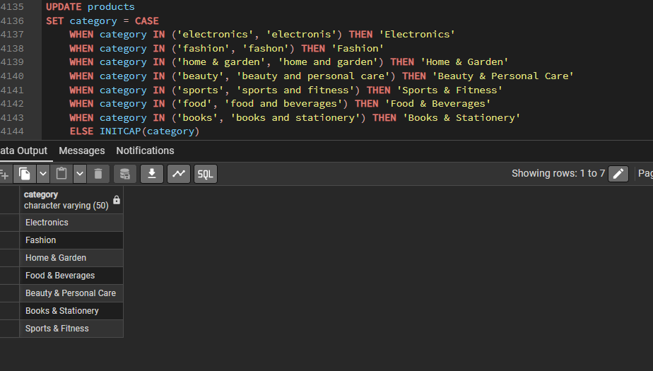

# TradeZone-Marketplace-Performance-Review-2023-2024
Translating SQL Analysis into Business Decisions for Growth & Seller Operations

---

## 📌 Table of Contents


- [Project Overview](#project-overview)
- [Business Problem](#Business-Problem)
- [My Role](#My-Role)
- [My Analytical Approach](#My-Analytical-Approach)
- [My Thinking Process](#My-Thinking-Process)
- [Dataset & Schema](#Dataset--Schema)
- [Part A: Data Quality Assessment & Cleaning](#Part-a-Data-Quality-Assessment--Cleaning)
- [Part B: Business Questions & SQL Analysis](#Part-b-Business-Questions--SQL-Analysis)
- [Part C: Key Insights](#Part-c-Key-Insights)
- [Recommendations](#Recommendations)
- [What the Data Cannot Tell Us](#What-the-Data-Cannot-Tell-Us)
- [Tools Used](#Tools-Used)
- [Repository Structure](#Repository-Structure)
- [How to Run](#How-to-Run)

---

## Project Overview
This project simulates the work of a Business Analyst embedded within the Growth and Seller Operations teams at **TradeZone**, a Nigerian e-commerce marketplace operating across Lagos, Abuja, Kano, Port Harcourt, and Ibadan. Despite rapid revenue growth between 2023 and 2024, leadership questioned the sustainability of this performance. Using PostgreSQL, I analyzed marketplace performance, investigated operational risks, and delivered recommendations to support 2025 planning decisions.

---

## Business Problem

**TradeZone delivered exceptional revenue growth in 2024, but leadership was concerned that the underlying drivers of this growth were becoming increasingly fragile. Customer conversion remained low in key markets, seller performance appeared inconsistent, and revenue seemed heavily dependent on a small group of customers and sellers.**

When reviewing the brief, three critical questions emerged:

- **Are newly acquired customers becoming active buyers? Strong acquisition numbers create little value if customers fail to make their first purchase.**
- **Is revenue diversified or concentrated? Rapid growth can conceal dependence on a small group of high-value customers, creating long-term risk.**
- **Can seller performance support sustainable growth? If marketplace quality depends on only a few high-performing sellers, customer experience and retention become vulnerable.**

These questions shaped the analysis. Additional areas such as payment behavior, product performance, customer ratings, and quarterly revenue trends were examined to provide supporting context and identify the operational factors influencing marketplace growth.

---

## My Role

As the Business Analyst supporting the Growth and Seller Operations teams, I was responsible for:

1. **Assessing data quality and identifying reporting risks.**
2. **Cleaning and validating marketplace data.**
3. **Developing SQL queries to answer executive business questions.**
4. **Translating analytical findings into business insights.**
5. **Deliver an analyst memo** translating query results into decisions that decision-makers can act on.

---

## My Analytical Approach

The project followed a structured analytical workflow:

Step 1: **Data Quality Assessment**

**Identified missing values, duplicate records, inconsistent formatting, and reporting risks.**

Step 2: **Data Cleaning**

**Standardized location fields, validated revenue records, and documented all cleaning decisions.**

Step 3: **SQL Analysis**

**Developed queries to answer eight business questions related to customer growth, seller performance, revenue trends, and customer behavior.**

Step 4: **Insight Development**

**Converted query results into business findings and operational implications.**

Step 5: **Recommendation Development**

**Proposed actions aligned with Growth and Seller Operations objectives.**

Step 6: **Executive Communication**

**Delivered findings through a stakeholder-focused analyst memo.**

---

## My Thinking Process

### How I Identified the Most Important Risks

The analysis addressed eight business questions covering customer acquisition, revenue performance, seller operations, payment behavior, and marketplace quality. While each query provided useful information, not every result carried the same level of business risk.

To determine which findings mattered most, I focused on issues that could directly affect TradeZone's ability to sustain growth in 2025. Specifically, I looked for patterns that impacted customer acquisition efficiency, revenue stability, and marketplace quality.

This led me to prioritize three findings:

* **Customer Conversion Remains Weak Across Key Markets (Q1)** because acquiring customers creates little value if they do not become active buyers.

* **Revenue Is Concentrated Among High-Spending Customers (Q5)** because dependence on a small customer segment increases financial risk.

* **Seller Quality Distribution Is Uneven (Q3 & Q8)** because inconsistent seller performance affects customer experience, trust, and retention.

Together, these findings provide a more complete picture of TradeZone's performance than revenue growth alone. While the platform grew rapidly during 2024, the analysis suggests that long-term growth may be constrained unless customer activation, revenue diversification, and seller quality are improved.


## Dataset & Schema

The TradeZone database contains **7 tables**:

| Table | Description |
|---|---|
| `customers` | Customer profiles, location, signup date, account status |
| `orders` | Order records with status, dates, and total amount |
| `order_items` | Line-level product details per order |
| `products` | Product catalogue with category and unit price |
| `sellers` | Seller profiles, category, location, account status |
| `payments` | Payment method and amount per order |
| `reviews` | Customer ratings per product and order |

---

## Part A: Data Quality Assessment & Cleaning

Before conducting the analysis, the dataset was audited for quality issues that could affect reporting accuracy.

### Missing Revenue Data

The most significant issue involved missing revenue-related fields across multiple tables.

| Table       | Issue Identified                                 |
| ----------- | ------------------------------------------------ |
| products    | 4 products missing | `unit_price`                  |
| order_items | 97 records missing | `unit_price` and `line_total` |
| orders      | 71 delivered orders missing | `total_amount`       |
| payments    | 155 records missing payment amounts              |

Further investigation showed that all affected records were linked to four products loaded into the database without a unit price:


Because order values are calculated from product prices, missing unit prices propagated into order totals and payment amounts.

**Decision:** Product prices were not estimated due to the absence of a reliable reference source. Affected records were retained, and revenue analysis was performed using valid transaction values only.

**Business Impact:** Revenue figures may be understated in product, category, and quarterly revenue analyses where these products were involved.

---

### Location Standardization

Customer and seller location fields contained inconsistent formatting, including variations such as:

* Lagos / lagos / Lago s
* Port Harcourt / PortHarcourt / Port-Harcourt
* Ibadan / IBADAN


**Decision:** Location values were standardized using trimming, casing, and known location corrections to ensure consistent geographic reporting.

**Business Impact:** Improved accuracy of state-level analyses, particularly customer conversion and payment behavior reporting.

---

### Duplicate and Data Validation Checks

Additional validation checks were performed to ensure data integrity:

* No duplicate customer, seller, or order records were identified.
* Product prices were validated to ensure no negative values existed.
* Review ratings outside the expected range were flagged for review.
* Order totals were compared against item-level calculations to identify potential inconsistencies.




These checks helped improve confidence in the reliability of the final analysis and recommendations.

---

 ## Part B: Business Questions & SQL Analysis
 
### Q1: Customer Acquisition & 30-Day Conversion
*Find the top 5 states by new sign-ups in 2024 and calculate the percentage who made at least one purchase within 30 days of signing up.*


**Result:** Lagos achieved the highest conversion rate (49.3%) while Kano (31.0%) and Oyo (33.3%) underperformed.


### Q2: Product Performance
*Top 10 products by total revenue in 2024.*

**Result:** All top 10 products were Electronics. HP Pavilion 15 Laptop led with ₦26.7M in revenue across 25 orders. The top 10 ranged from ₦17.7M to ₦26.7M, reflecting strong demand for tech hardware and accessories.


---

### Q3: Seller Fulfilment Efficiency
*Top 20 fastest sellers by average fulfilment hours, among those with at least 20 completed orders.*

**Result:** Fastest fulfilment: **seller_id SELL034** at 91.20 hours average. However, SELL034 holds only a 3.25 customer rating despite being the quickest — showing that speed alone does not drive satisfaction. **seller_id SELL024** combined competitive speed (98.40 hrs) with a 4.08 rating.


---

### Q4: Quarterly Revenue Trends
*Compare quarterly revenue across 2023 and 2024. Identify the strongest growth quarter.*


**Result:** Q4 2024 recorded the strongest absolute revenue growth, increasing revenue by approximately ₦131.1M compared to Q4 2023 However, Q2 2024 achieved the highest year-over-year growth rate at 564.8%. 


---

### Q5: Customer Spend Segmentation
*Segment 2024 customers into High, Medium, and Low Spenders.*

**Result:** High Spenders account for **99.6% of all 2024 revenue.**


---

### Q6: Payment Method Preferences by State
*Transaction count and total amount per payment method, per state.*

**Result:** Card dominates in Lagos (371 transactions) and Rivers. Mobile Money leads in Kano. Cash on Delivery leads in Oyo. Urban states favour digital payments; others still rely on traditional methods.


---

### Q7: Review Ratings and Sales Performance
*Group products by average rating. Calculate product count, total revenue and average unit price per group.*

**Result:** Mid-Rated products outsell High-Rated products by approximately ₦500 million.


---

### Q8 — Top Seller Bonus Qualification
*Top 10 sellers in 2024 by revenue, with at least 10 completed orders and average rating ≥ 4.0.*

**Result:** 10 sellers qualified. **seller-id SELL024** led with ₦11M revenue and 4.08 rating. All 10 completed between 10 and 19 orders. Strong candidates for the 2025 bonus programme.


---

## Part C: Key Insights

 ### Insight 1: Weak Customer Conversion Despite High Acquisition. More Than Half of New Customers Are Not Converting Within 30 Days
 *(Source: Q1)*

Customer conversion remains a significant challenge across key markets. Even in Lagos, the platform's strongest acquisition state, only 49.32% of new sign-ups completed a purchase within 30 days. Conversion falls further in Kano at 31.03%. Across the top acquisition states, between 50% and 69% of newly acquired customers fail to transact within their first month. This indicates that TradeZone is effective at attracting users but less effective at activating them, reducing acquisition ROI and limiting the pipeline of future high-value customers.


 ### Insight 2:  Revenue Is Highly Concentrated Among High-Spending Customers 
 *(Source: Q5)*

High-spending customers (≥ ₦100,000) contributed **₦412.9M** in revenue, compared to just **₦3.8M** from medium spenders and **₦1.8M** from low spenders. This indicates that TradeZone's revenue performance is overwhelmingly dependent on a small segment of high-value customers.
The risk is not simply concentration; it is dependency. If a relatively small portion of these customers reduce their spending or stop purchasing altogether, overall platform revenue would be materially affected. The limited contribution from medium- and low-spending customers suggests that TradeZone has not yet developed a sufficiently broad revenue base to offset potential churn among its highest-value customers. Rather than a balanced customer portfolio, the platform relies heavily on a single revenue-driving segment, creating a structural risk to sustainable growth.


 ### Insight 3: Seller Performance Is Uneven and Creates Marketplace Risk 
 *(Source: Q3 & Q8)*

A small group of sellers consistently meets both fulfilment and quality standards, while a broader segment operates below the platform's performance benchmarks. Some lower-rated sellers also process a significant volume of orders, increasing their influence on the overall customer experience. This creates a two-tier marketplace where a limited number of high-performing sellers sustain platform quality, while underperforming sellers contribute to inconsistent customer experiences. As a result, customer trust becomes vulnerable to seller performance, making it more difficult to improve retention and scale growth sustainably.

---

## Recommendation

### Recommendation 1: Improve Early Customer Activation

**Action**

Deploy a structured 14-day onboarding and activation campaign targeting low-converting states such as Kano and Oyo. The program should include first-purchase incentives, personalized product recommendations, and targeted follow-up communications designed to encourage an initial transaction.

**Owner**: Growth Team

**Expected Outcome (60–90 Days)**

* Increase 30-day customer conversion rates in underperforming states
* Improve monetization of newly acquired users
* Increase first-purchase revenue
* Improve customer acquisition ROI

### Recommendation 2: Strengthen Seller Performance Management

**Action**

Implement a seller segmentation framework based on fulfilment efficiency and customer ratings, with clear thresholds for rewards, performance monitoring, and corrective action. Sellers consistently falling below performance standards should be placed on improvement plans or deprioritized within the marketplace.

**Owner**: Seller Operations Team

**Expected Outcome (60–90 Days)**

* Improve seller quality consistency across the platform
* Increase fulfilment reliability
* Reduce negative customer experiences linked to low-performing sellers
* Strengthen customer trust and marketplace reputation

---

## What the Data Cannot Tell Us

**Business Question**: Why are newly acquired customers failing to convert into paying users within their first 30 days?

**Limitation**: The dataset shows whether customers convert, but not why they fail to convert.

It cannot determine whether inactivity is caused by:

* Pricing concerns
* Poor onboarding experiences
* Product dissatisfaction
* Delivery expectations
* Competitor switching

Additional Data Required
* Customer behavioural data (sessions, product views, cart abandonment)
* Customer feedback data (surveys, churn reasons)
* Marketing attribution data (campaign source and acquisition channel)

This information would allow TradeZone to identify where customers disengage and design targeted retention strategies.

---

## Tools Used

| Tool | Purpose |
|---|---|
| **PostgreSQL 17** | All data cleaning and business queries |
| **pgAdmin** | Query execution and result validation |
| **SQL (CTEs, Window Functions, Aggregate Functions, CASE, JOINS)** | Core query logic |

---

## Repository Structure

```
TradeZone-Marketplace-Performance-Review/
│
├── README.md
│
├── Part 1.sql               # Part A: Full data cleaning script
│
├── Q1.sql                   # Customer Acquisition & 30-Day Conversion
├── Q2.sql                   # Product Performance
├── Q3.sql                   # Seller Fulfilment Efficiency
├── Q4.sql                   # Quarterly Revenue Trends
├── Q5.sql                   # Customer Spend Segmentation
├── Q6.sql                   # Payment Method Preferences by State
├── Q7.sql                   # Review Ratings and Sales Performance
├── Q8.sql                   # Top Seller Bonus Qualification
│
│
└── Analyst_Memo.pdf         # Part C: For Head of Growth and Head of Seller Operations.
```

---

## How to Run
* Clone this repository.
* Import the TradeZone database into PostgreSQL.
* Open pgAdmin or your preferred SQL editor.
* Open any `.sql` file directly in pgAdmin and execute.
* Review query outputs and compare findings with the Executive Memo.


## Key Takeaway

TradeZone's strong revenue growth in 2024 masks several underlying operational risks, including weak customer activation, revenue concentration among high-value customers, and uneven seller performance.

By combining SQL analysis, data quality investigation, and business-focused reporting, this project demonstrates how data can be translated into actionable insights and recommendations that support strategic decision-making for Growth and Seller Operations teams.

The analysis shows that sustainable growth depends not only on acquiring more customers, but also on improving conversion, broadening the revenue base, and maintaining consistent marketplace quality.


