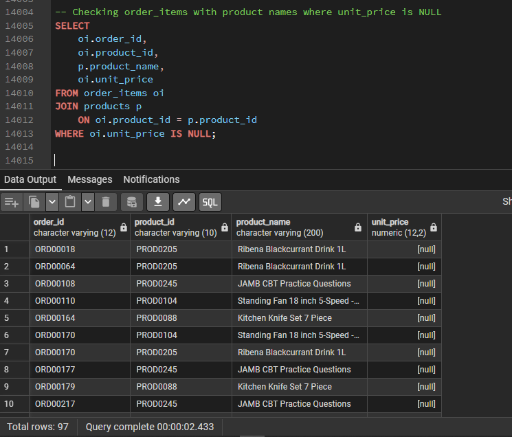
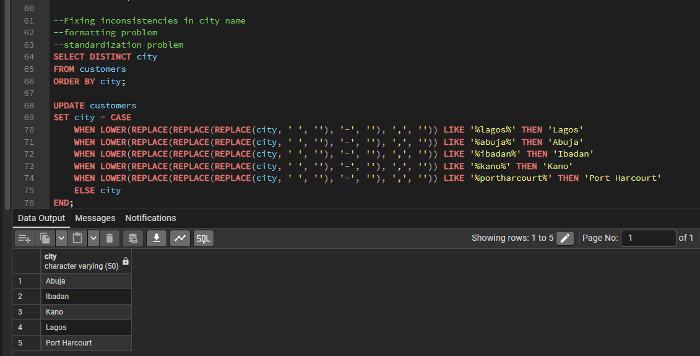

# TradeZone-Marketplace-Performance-Review-2023-2024
Translating SQL Analysis into Business Decisions for Growth & Seller Operations

---

## 📌 Table of Contents

- [Project Overview](#project-overview)
- [Business Problem](#Business-Problem)
- [My Role](#My-Role)
- [My Analytical Approach](#My-Analytical-Approach)
- [My Thinking Process](#My-Thinking-Process)
- [Dataset & Schema](#Dataset--Schema)
- [Part A: Data Quality Assessment & Cleaning](#Part-a-Data-Quality-Assessment--Cleaning)
- [Part B: Business Questions & SQL Analysis](#Part-b-Business-Questions--SQL-Analysis)
- [Part C: Key Insights](#Part-c-Key-Insights)
- [Recommendations](#Recommendations)
- [What the Data Cannot Tell Us](#What-the-Data-Cannot-Tell-Us)
- [Executive Memo](#Executive-Memo)
- [Tools Used](#Tools-Used)
- [Repository Structure](#Repository-Structure)
- [How to Run](#How-to-Run)

---

## Project Overview
This project simulates the work of a Business Analyst embedded within the Growth and Seller Operations teams at **TradeZone**, a Nigerian e-commerce marketplace operating across Lagos, Abuja, Kano, Port Harcourt, and Ibadan. Despite rapid revenue growth between 2023 and 2024, leadership questioned the sustainability of this performance. Using PostgreSQL, I analyzed marketplace performance, investigated operational risks, and delivered recommendations to support 2025 planning decisions.

---

## Business Problem

**TradeZone delivered exceptional revenue growth in 2024, but leadership was concerned that the underlying drivers of this growth were becoming increasingly fragile. Customer conversion remained low in key markets, seller performance appeared inconsistent, and revenue seemed heavily dependent on a small group of customers and sellers.**

When reviewing the brief, three critical questions emerged:

- **Are newly acquired customers becoming active buyers? Strong acquisition numbers create little value if customers fail to make their first purchase.**
- **Is revenue diversified or concentrated? Rapid growth can conceal dependence on a small group of high-value customers, creating long-term risk.**
- **Can seller performance support sustainable growth? If marketplace quality depends on only a few high-performing sellers, customer experience and retention become vulnerable.**

These questions shaped the analysis. Additional areas such as payment behavior, product performance, customer ratings, and quarterly revenue trends were examined to provide supporting context and identify the operational factors influencing marketplace growth.

---

## My Role

As the Business Analyst supporting the Growth and Seller Operations teams, I was responsible for:

1. **Assessing data quality and identifying reporting risks.**
2. **Cleaning and validating marketplace data.**
3. **Developing SQL queries to answer executive business questions.**
4. **Translating analytical findings into business insights.**
5. **Deliver an analyst memo** translating query results into decisions that decision-makers can act on.

---

## My Analytical Approach

The project followed a structured analytical workflow:

Step 1: **Data Quality Assessment**

**Identified missing values, duplicate records, inconsistent formatting, and reporting risks.**

Step 2: **Data Cleaning**

**Standardized location fields, validated revenue records, and documented all cleaning decisions.**

Step 3: **SQL Analysis**

**Developed queries to answer eight business questions related to customer growth, seller performance, revenue trends, and customer behavior.**

Step 4: **Insight Development**

**Converted query results into business findings and operational implications.**

Step 5: **Recommendation Development**

**Proposed actions aligned with Growth and Seller Operations objectives.**

Step 6: **Executive Communication**

**Delivered findings through a stakeholder-focused analyst memo.**

---

## My Thinking Process

### How I Identified the Most Important Risks

The analysis addressed eight business questions covering customer acquisition, revenue performance, seller operations, payment behavior, and marketplace quality. While each query provided useful information, not every result carried the same level of business risk.

To determine which findings mattered most, I focused on issues that could directly affect TradeZone's ability to sustain growth in 2025. Specifically, I looked for patterns that impacted customer acquisition efficiency, revenue stability, and marketplace quality.

This led me to prioritize three findings:

* **Customer Conversion Remains Weak Across Key Markets (Q1)** because acquiring customers creates little value if they do not become active buyers.

* **Revenue Is Concentrated Among High-Spending Customers (Q5)** because dependence on a small customer segment increases financial risk.

* **Seller Quality Distribution Is Uneven (Q3 & Q8)** because inconsistent seller performance affects customer experience, trust, and retention.

Together, these findings provide a more complete picture of TradeZone's performance than revenue growth alone. While the platform grew rapidly during 2024, the analysis suggests that long-term growth may be constrained unless customer activation, revenue diversification, and seller quality are improved.

## Dataset & Schema

The TradeZone database contains **7 tables**:

| Table | Description |
|---|---|
| `customers` | Customer profiles, location, signup date, account status |
| `orders` | Order records with status, dates, and total amount |
| `order_items` | Line-level product details per order |
| `products` | Product catalogue with category and unit price |
| `sellers` | Seller profiles, category, location, account status |
| `payments` | Payment method and amount per order |
| `reviews` | Customer ratings per product and order |

---

## Part A: Data Quality Assessment & Cleaning

Before conducting the analysis, the dataset was audited for quality issues that could affect reporting accuracy.

### Missing Revenue Data

The most significant issue involved missing revenue-related fields across multiple tables.

| Table       | Issue Identified                                 |
| ----------- | ------------------------------------------------ |
| products    | 4 products missing | `unit_price`                  |
| order_items | 97 records missing | `unit_price` and `line_total` |
| orders      | 71 delivered orders missing | `total_amount`       |
| payments    | 155 records missing payment amounts              |

Further investigation showed that all affected records were linked to four products loaded into the database without a unit price:

Because order values are calculated from product prices, missing unit prices propagated into order totals and payment amounts.

**Decision:** Product prices were not estimated due to the absence of a reliable reference source. Affected records were retained, and revenue analysis was performed using valid transaction values only.

**Business Impact:** Revenue figures may be understated in product, category, and quarterly revenue analyses where these products were involved.

---

### Location Standardization

Customer and seller location fields contained inconsistent formatting, including variations such as:

* Lagos / lagos / Lago s
* Port Harcourt / PortHarcourt / Port-Harcourt
* Ibadan / IBADAN

**Decision:** Location values were standardized using trimming, casing, and known location corrections to ensure consistent geographic reporting.

**Business Impact:** Improved accuracy of state-level analyses, particularly customer conversion and payment behavior reporting.

---

### Duplicate and Data Validation Checks

Additional validation checks were performed to ensure data integrity:

* No duplicate customer, seller, or order records were identified.
* Product prices were validated to ensure no negative values existed.
* Review ratings outside the expected range were flagged for review.
* Order totals were compared against item-level calculations to identify potential inconsistencies.

These checks helped improve confidence in the reliability of the final analysis and recommendations.

